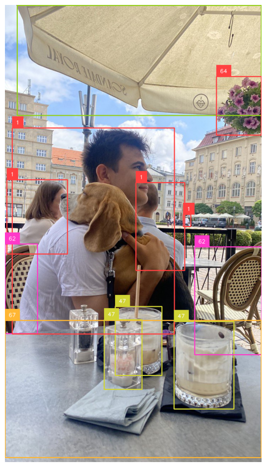
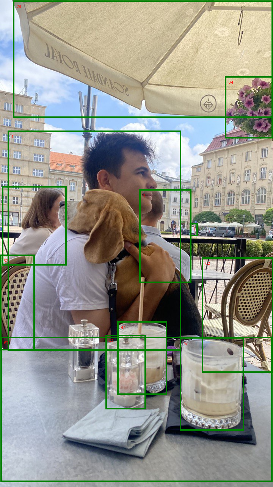

# RF-DETR with ONNX

[](https://huggingface.co/PierreMarieCurie/rf-detr-onnx/blob/main/rf-detr-base.onnx)


This repository contains code to load an ONNX version of RF-DETR and perform inference, including drawing the results on images. It demonstrates how to convert a PyTorch model to ONNX format and run real-time inference with minimal dependencies.

RF-DETR is a transformer-based object detection architecture developed by Roboflow. For more details on the model, please refer to the impressive work by the Roboflow team [here](https://github.com/roboflow/rf-detr/tree/main).

| Official Repo | ONNX Runtime Inference |
|----------------------|-----------------------------|
| <p align="center"></p> | <p align="center"></p> |

## Requirements

Ensure you have the following dependencies installed:
- onnxruntime
- Pillow
- numpy

Please note that the scripts have been tested with:
-  Python 3.11.11
-  onnxruntime 1.21.0
-  numpy 2.2.4
-  Pillow 11.1.0

First, clone the repository:

```bash
git clone https://github.com/PierreMarieCurie/rf-detr-onnx.git
```

Then, install the required dependencies using pip:

```bash
pip install requirements.txt
```

# Download the Model

### Directly from Huggin-face

You can download the original model from Hugging Face using this link:

[Download Model from Hugging Face](https://huggingface.co/PierreMarieCurie/rf-detr-onnx/resolve/main/rf-detr-base.onnx)

### Or generate it from rf-detr module

First, install the required dependencies using pip:
``` bash
pip install rfdetr
```
Then, export the model:

``` bash
python export.py --model_name rf-detr-base.onnx
```

# Inference Script Example

Below is an example showing how to perform inference on an image:

``` Python
from rf_detr import RTDETR_ONNX

# Get model and image
image_path = "https://media.roboflow.com/notebooks/examples/dog-2.jpeg"
model_path = "rf-detr-base.onnx"

# Initialize the model
model = RTDETR_ONNX(model_path)

# Run inference and get detections
_, labels, boxes = model.run_inference(image_path)

# Draw and display the detections
model.save_detections(image_path, boxes, labels, "saved_image.jpg")
```

# License

This repository is licensed under the MIT License. See [license file](LICENSE) for more details.

However, RF-DETR pretrained weights and some parts of the code are derived from software licensed under the Apache License 2.0. See [notice](NOTICE) for more details.

# Acknowledgements
- Thanks to the Roboflow team and everyone involved in the development of RF-DETR, particularly for sharing a state-of-the-art model under a permissive free software license.